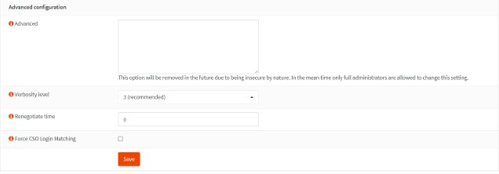

# Konfigurasi OPNsense dan Installasi

## Alur Installasi OPNsense
Tatacara installasi OPNsense beserta langkah-langkah konfigurasi untuk OPNSense

### Download ISO image OPNsense
Untuk Link website download bisa dilihat dibawah berikut
- https://opnsense.org/download/
- https://sourceforge.net/projects/opnsense/

### Konfigurasi OPNsense
Untuk menkonfigurasi OPNsense terlebih dahulu untuk membuat atau menginstall OPNsense di Virtual machine.

Langkah-langkah konfigurasi :
- A. Pilih Option 2 karena kita mau set interface IP addressnya.
  
  B. Setelah itu pilih nomer 1 yaitu LAN (le1 - dhcp)
  
  C. Configurasi ipv4 via dhcp pilih opsi Y

  

- selebihnya pilih opsi no semua, karena kita tidak menggunakan ipv6 lalu dia akan mulai memproses

  

- Setelah selesai memproses, kita akan mendapatkan URL yang akan kita gunukan untuk masuk kehalaman dashboard login opnsense. (https://IP_OPNsense)

  

- Untuk username & Password jika dalam penginstalan awal kita tidak merubah passwordnya sama sekali, login saja menggunakan password default dari Opnsense yaitu 
  
  Username: root

  Password: opnsense 

  

### Konfigurasi IDS pada OPNsense
Konfigurasi IDS OPNsense

- Pada bagian ini menjelaskan mengenai tahapan konfigurasi IDS pada OPNSense, Langkah-langkahnya sebagai berikut :
  A. klik pada menu “service” pilih sub menu “Intrusion Detection”. 
  
  B. Kemudian pada bar menu, pilih “Download”, setelah itu beri tanda centang pada semua paket suricata yang akan di download. 
  
  C. lalu klik “enable selected”. Kemudian klik “Download & Update Rules”

  

- Lihat pada tab rules sudah terlihat paket suricata yang sudah ter Download.

  

- kemudian beralih ke tab setting. 
  A. Beri tanda  centang pada “Enable”, “IPS Mode”, dan "Promiscuous mode”
  
  B. Pada bagian pattern matcher lalu pilih “Hyperscan”, pada bagian interfaces pilih “LAN, WAN” lalu Apply. IDS Siap digunakan

  

- Kita melakukan PING terlebih dahulu Web server yang telah kita buat, jika berhasil maka OPNsense akan mendeteksi adanya aktivitas yang sedang terjadi pada web server kita.

  

  

- Kita lihat pada bagian tab alert sudah ada beberapa packet yang telah terdeteksi oleh OPNsense

  

### Konfigurasi VPN pada OPNsense
Konfigurasi VPN atau OpenVPN pada OPNsense

- Creating a Certificate Authority
  A. Masuk ke System → Trust → Authorities.

  

  B. Klik tombol tambah dengan ikon + di pojok kanan atas formulir untuk membuat yang baru.

  C. Isi kolom Nama Deskriptif untuk Otoritas Sertifikat, seperti OPNsenseOpenVPNCA.

  D. Pilih Buat Otoritas Sertifikat internal untuk opsi Metode.

  E. Pilih RSA untuk Jenis Kunci.

  F.Atur Panjang kunci (bit) ke 4096. Panjang bit yang lebih panjang akan meningkatkan keamanan kunci, namun juga meningkatkan waktu pemrosesan. Panjang kunci tidak disarankan kurang dari 2048 bit.

  G. Algoritma Intisari ke SHA512.

  H. Tetapkan Lifetime (hari) ke 365 yang berarti sertifikat apa pun yang ditandatangani oleh CA ini akan menjadi tidak valid setelah satu tahun. Untuk firewall jaringan rumah, Anda dapat menyetel masa pakainya lebih lama.

  I. Tetapkan Kode Negara, seperti AS.

  J. Tetapkan Negara Bagian, seperti California.

  K. Atur Kota, seperti Sunnyvale.

  L. Tetapkan Organisasi, seperti Perusahaan Saya.

  M. Tetapkan Alamat Email.

  N. Setel Nama Umum ke internal-openvpn-ca.

  O. Klik Simpan.

  

- Creating a Server Certificate
  A. Masuk ke System → Trust → Certificates.
  
  

  B. Klik tombol tambah dengan ikon + di pojok kanan atas formulir untuk membuat yang baru.
  
  C. Pilih Buat Sertifikat internal untuk opsi Metode.
  
  D. Isi kolom Deskripsi untuk Sertifikat Server, misalnya Sertifikat Server OpenVPN.
  
  E. Tetapkan Otoritas Sertifikat ke OPNsenseOpenVPNCA.
  
  F. Setel Jenis ke Sertifikat Server.
  
  G. Atur panjang kunci (bit) ke 4096.
  
  H. Algoritma Intisari ke SHA512.
  
  I. Atur Seumur Hidup (hari) ke 365.
  
  J. Setel Lokasi kunci pribadi ke Simpan di firewall ini.

  

  K. Tetapkan Kode Negara, seperti AS.
  
  L. Tetapkan Negara Bagian, seperti California.
  
  M. Atur Kota, seperti Sunnyvale.

  N. Tetapkan Organisasi, seperti Perusahaan Saya.
  
  O. Tetapkan Alamat Email.
  
  P. Tetapkan Nama Umum ke Sertifikat Server OpenVPN.
  
  Q. Biarkan pengaturan lainnya sebagai default.

  

  R. Click Save.

  

- Creating a VPN User
  1. Adding OPNsense Local User

    A. Navigasikan ke Sistem → Akses → Pengguna di firewall OPNsense Anda.

    B. Masukkan Nama Pengguna unik untuk akun VPN, seperti vpnuser1.

    C. Masukkan Kata Sandi yang kuat untuk pengguna VPN.

    D. Isi kolom Nama Lengkap.

    E. Anda dapat memasukkan E-Mail.

    

    F. Anda dapat membiarkan shell Login sebagai /sbin/nologin jika akun VPN hanya akan digunakan untuk akses VPN. Opsi ini mencegah pengguna masuk ke UI web OPNsense.

    G. Anda dapat memasukkan tanggal Kedaluwarsa atau membiarkannya kosong jika akun tidak kedaluwarsa.

    H. Centang Klik untuk membuat sertifikat pengguna untuk opsi Sertifikat. Sehingga sertifikat pengguna dapat dibuat sekaligus membuat akun pengguna secara otomatis.

    I. Centang opsi Hasilkan rahasia baru untuk benih OTP guna mengaktifkan MFA bagi pengguna VPN Anda.

    J. Anda dapat membiarkan pengaturan lainnya sebagai default.

    K. Klik tombol Simpan untuk menerapkan pengaturan. Ini akan mengarahkan Anda ke halaman sertifikat untuk membuat sertifikat pengguna VPN. Pembuatan sertifikat untuk akun pengguna VPN dijelaskan di bagian selanjutnya.

    

  2. Creating Certificate for the VPN User

    A. Pilih Buat Sertifikat internal untuk opsi Metode.
  
    B. Anda dapat membiarkan kolom Nama Deskriptif apa adanya, dalam contoh kami vpnuser1.
  
    C. Tetapkan otoritas Sertifikat ke OPNsenseOpenVPNCA.
  
    D. Setel Jenis ke Sertifikat Klien.
  
    E. Atur panjang kunci (bit) ke 4096.
  
    F. Setel Algoritma Intisari ke SHA512.
  
    G. Atur Seumur Hidup (hari) ke 365.
  
    H. Setel Lokasi kunci pribadi ke Simpan di firewall ini.

    

    I. Biarkan pengaturan lainnya sebagai default.

    

    J. Klik tombol Simpan. Ini akan mengarahkan Anda ke halaman Pengguna.

    I. Gulir ke bawah ke opsi kode QR OTP.
    
    J. Klik tombol Klik untuk memperlihatkan untuk mengaktifkan seed yang baru Anda buat dengan aplikasi yang kompatibel dengan Google Authenticator. Anda akan diberikan kode QR yang dapat Anda pindai dengan ponsel Anda.

    

    K. Kirim kode QR ke pengguna dengan cara yang aman.

    

    L. Klik tombol Simpan untuk mengaktifkan pengaturan.
    
    M. Anda dapat melihat sertifikat yang dibuat untuk pengguna VPN dengan membuka Sistem > Kepercayaan > Sertifikat di firewall OPNsense Anda.

    

- Add TOTP Access Server
  A. Masuk ke System > Access > Servers.

  

  B. Klik tombol tambah dengan ikon + di pojok kanan atas formulir untuk membuat yang baru.
  
  C. Isi kolom Nama deskriptif untuk Server, seperti TOTP VPN Access Server.
  
  D. Atur Jenis ke Lokal + Kata Sandi Sekali Pakai Berbasis Waktu.
  
  E. Biarkan opsi lain sebagai default jika Anda menggunakan Google Authenticator seperti pada tutorial kami. Untuk token lainnya, Anda mungkin perlu mengubah opsi Panjang Token.
  
  F. Klik Simpan untuk menambahkan server TOTP.

  

- Add OpenVPN Server
  A. Masuk ke VPN > OpenVPN > Servers
  
  

  B. Klik tombol tambah dengan ikon + di pojok kanan atas formulir untuk membuat yang baru.

  C. Isi kolom Nama deskriptif untuk Server, seperti Server OpenVPN Saya.
  
  D. Pilih Akses Jarak Jauh (SSL/TLS + User Auth) untuk Mode Server karena kita akan menggunakan MFA.
  
  E. Pilih TOTP VPN Access Server untuk Backend untuk otentikasi.

  F. Setel Protokol ke UDP.

  G. Pilih tun untuk Mode Perangkat.
  
  H. Setel Antarmuka ke WAN. Jika Anda memiliki beberapa antarmuka WAN, Anda dapat memilih salah satu.
  
  I. Anda dapat membiarkan Port Lokal sebagai default, 1194. Atau, Anda dapat mengubahnya sesuai keinginan untuk alasan keamanan.

  

  J. Setel Otentikasi TLS ke Diaktifkan-Otentikasi & enkripsi.
  
  K. Centang Secara otomatis menghasilkan kunci autentikasi TLS bersama untuk opsi Kunci Bersama TLS.
  
  L. Tetapkan Otoritas Sertifikat Sejawat ke OPNsenseOpenVPNCA.
  
  M. Atur Sertifikat Server ke Sertifikat Server VPN Terbuka
  
  N. Atur Panjang Parameter DH ke 4096 bit.
  
  O. Anda dapat mengatur algoritma Enkripsi ke AES-256-GCM (kunci 256-bit, blok 128-bit)
  
  P. Atur Algoritma Auth Digest ke SHA512.
  
  Q. Atur Kedalaman Sertifikat ke Satu (Klien+Server).
  
  R. Anda dapat mencentang opsi Pencocokan Pengguna/CN yang Ketat untuk menerapkan kecocokan antara Nama Umum sertifikat klien dan nama pengguna yang diberikan saat login untuk keamanan lebih.

  

  S. Masukkan rentang alamat IP dalam format CIDR untuk Jaringan Terowongan IPv4. Ini adalah rentang alamat IP yang akan digunakan oleh klien VPN Anda. Sebagai Jaringan Terowongan Anda, pilih rentang IP yang saat ini tidak digunakan di jaringan Anda. Dalam tutorial ini, kita akan memilih 192.168.10.0/24 sebagai jaringan terowongan.
  
  T. Pilih opsi Redirect Gateway untuk memaksa klien mengakses Internet melalui firewall Anda. Jika Anda tidak ingin mengaktifkan opsi ini, Anda dapat memasukkan alamat LAN Anda untuk Jaringan Lokal IPv4. Sehingga klien VPN Anda dapat diakses dari jaringan lokal Anda, seperti 10.10.10.0/24.
  
  U. Anda dapat mengatur Jaringan Jarak Jauh IPv4 dengan memasukkan LAN jarak jauh untuk menyiapkan VPN situs-ke-situs. Anda dapat mengosongkannya jika Anda tidak perlu menyiapkan VPN situs-ke-situs.
  
  V. Anda dapat menetapkan nilai untuk opsi Koneksi Bersamaan. Opsi ini menentukan jumlah maksimum klien yang dapat terhubung ke server OpenVPN ini secara bersamaan. Ini adalah batasan global yang berlaku untuk semua klien yang terhubung, bukan batas per pengguna. Server OpenVPN akan mengizinkan koneksi dalam jumlah tidak terbatas ke server Anda secara default. Disarankan untuk menetapkan nilai ini ke nilai yang wajar, meskipun hanya untuk tujuan kewarasan.
  
  W. Pilih algoritma LZO lama dengan kompresi adaptif untuk Kompresi. Jika OpenVPN mendeteksi bahwa data dalam paket tidak dikompresi secara efisien, mode ini akan menonaktifkan kompresi secara dinamis selama jangka waktu tertentu.
  
  X. Anda dapat mencentang opsi Komunikasi antarklien untuk mengizinkan komunikasi antara klien VPN yang terhubung ke server OpenVPN Anda. Biasanya, Anda tidak perlu mengaktifkan opsi ini.
  
  Y. Anda dapat mencentang opsi Koneksi Duplikat untuk mengizinkan beberapa koneksi bersamaan dari klien VPN menggunakan Nama Umum yang sama. Meskipun opsi ini tidak disarankan, Anda mungkin perlu mengaktifkannya dalam beberapa kasus.

  

  Z. Anda dapat mengaktifkan opsi IP Dinamis yang memungkinkan klien yang sudah terhubung untuk mengubah alamat IP-nya tanpa menyambung kembali.
  
  A.A. Centang opsi Kumpulan Alamat untuk memberikan alamat IP adaptor virtual ke klien VPN.
  
  A.B. Aktifkan opsi Topologi sehingga klien VPN hanya menerima satu IP dan bukan subnet IP terisolasi. Untuk kompatibilitas dengan klien Windows OpenVPN yang lebih lama, ini dinonaktifkan secara default.
  
  A.C. Jika Anda menentukan Domain Default DNS, nilai ini akan digunakan sebagai akhiran DNS untuk klien VPN Anda. Jika klien Anda ingin mencari nama host internal Anda tanpa menggunakan FQDN, ini bisa berguna.
  
  A.D. Anda dapat memeriksa Server DNS dan kemudian memasukkan alamat IP server DNS jika Anda mau. Jika Anda memiliki server DNS internal, Anda harus memasukkan alamat IP-nya di sini.
  
  A.E. Anda dapat mencentang opsi Paksa pembaruan cache DNS untuk mendorong klien Windows agar mengenali server DNS yang didorong jika Anda mau.
  
  A.F. Anda dapat mencentang opsi Cegah kebocoran DNS untuk memblokir server DNS di adaptor jaringan lain jika Anda mau.
  
  A.G. Anda dapat memeriksa Server NTP dan kemudian memasukkan alamat IP server NTP jika Anda mau.
  
  A.H. Anda dapat memeriksa Opsi NetBIOS untuk mengaktifkan NetBIOS melalui TCP/IP jika Anda mau.

  

  A.I. Pilih 3 untuk tingkat Verbositas untuk menampilkan negosiasi TLS & info rute.
  
  A.J. Atur waktu negosiasi ulang ke 0 untuk menonaktifkan kunci saluran data negosiasi ulang karena kita akan menggunakan OTP dalam tutorial kita.
  
  A.K. Biarkan opsi lain sebagai default.

  

  A.L. Klik Simpan di bagian bawah halaman untuk mengaktifkan pengaturan.

  

- Add Firewall Rules
  1. Allow traffic from clients to VPN server

    A. Mengizinkan akses ke port server OpenVPN, UDP/1194 default, pada antarmuka WAN diperlukan untuk mengizinkan koneksi klien SSL VPN.

    

  2. Allow VPN clients access to Internet through VPN

    A. Masuk ke Firewall > Rules > OpenVPN

    

    B. Klik tombol tambah dengan ikon + di kanan atas halaman.
    
    C. Tetapkan Tindakan untuk Lulus.
    
    D. Setel Antarmuka ke OpenVPN.
    
    E. Setel Arah ke dalam.
    
    F. Pilih Host Tunggal atau Jaringan untuk Sumber dan atur rentang alamat IP VPN seperti 192.168.10.0/24.

    

    G. Pilih salah satu untuk Tujuan.
  
    H. Anda dapat mengetikkan Aturan VPN di bidang Kategori.
    
    I. Isi kolom Deskripsi, seperti Izinkan akses klien VPN.
    
    J. Anda dapat membiarkan pengaturan lainnya sebagai default.

    

    K. Klik tombol Simpan di bagian bawah halaman untuk menyimpan aturan.

    L. Klik Terapkan Perubahan untuk mengaktifkan aturan firewall baru.

    

- Export OpenVPN Client
  A. Masuk ke VPN > OpenVPN > Client Export

  B. Pilih server VPN yang baru dibuat dari daftar, seperti Server OpenVPN Saya UDP:1194, untuk Server Akses Jarak Jauh.
  
  C. Pilih File hanya untuk Jenis Ekspor. Karena Anda dapat dengan mudah mengimpor file konfigurasi berbasis teks ini ke aplikasi klien OpenVPN di berbagai platform, seperti Windows, macOS, Android, dan iOS.

  D. Biarkan pengaturan lainnya sebagai default. Untuk sebagian besar kasus, Nama Host harus berupa alamat IP publik firewall OPNsense Anda dan Port harus berupa nomor port yang telah Anda tetapkan untuk layanan VPN, defaultnya adalah 1194.

  

  E. Gulir ke bawah ke bagian bawah halaman. Daftar pengguna yang telah Anda konfigurasi ada di panel Akun/sertifikat, dan tombol unduh dengan ikon awan kecil ada di sisi kanan baris yang sesuai.
  
  F. Klik tombol unduh di sebelah pengguna klien VPN, vpnuser1.

  

- Connecting from a Windows PC client
  A. unduh sendiri file penginstal OpenVPN GUI terbaru dari situs resmi openvpn.net.
  
  B. Instal penginstal OpenVPN, biarkan semuanya pada pengaturan default dan setujui semuanya dengan Ya. Menginstal driver jaringan TAP mungkin diperlukan; lakukan jika diminta.
  
  C. Setelah menyelesaikan instalasi OpenVPN pada mesin klien Windows, ikon monitor kecil dengan loker muncul di bilah tugas Anda. Klik kanan padanya dan pilih Impor file untuk mengimpor file konfigurasi klien.
  
  

  D. Setelah berhasil mengimpor konfigurasi klien OpenVPN, klik kanan ikon OpenVPN di bilah tugas dan pilih file konfigurasi yang baru diimpor.

  

  E. Anda akan diberi tahu di kanan bawah layar dan ikon OpenVPN di taskbar akan berubah menjadi hijau ketika koneksi berhasil.

  

### Selesai